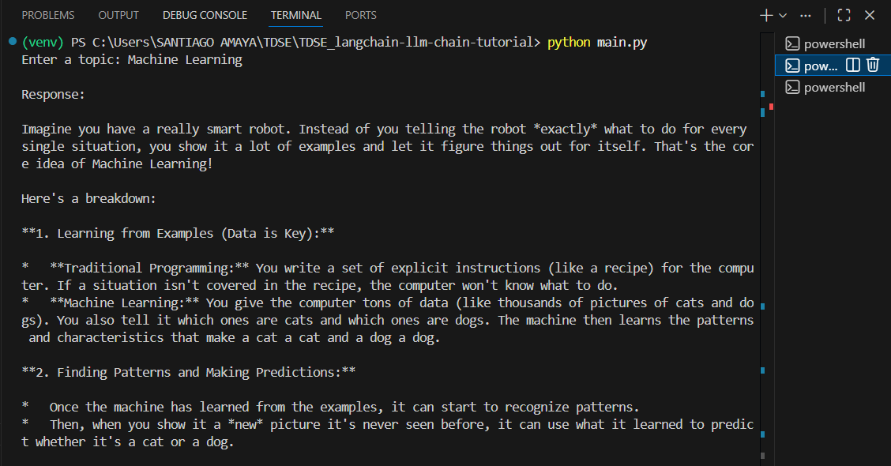

# LangChain LLM Chain Tutorial (Gemini Version)

## Project Overview

This repository contains the implementation of a basic **LangChain LLM Chain** using **Google Gemini** as the language model provider instead of OpenAI.

The objective of this project is to understand:

* How LangChain structures prompts
* How LLM chains are built
* How prompt → model → output parser pipelines work
* How to integrate Gemini into LangChain

---

## Architecture

The architecture is simple and linear:

User Input
↓
ChatPromptTemplate
↓
Gemini LLM (ChatGoogleGenerativeAI)
↓
Output Parser
↓
Final Response

### Components

* **ChatPromptTemplate** → Structures system and user messages.
* **ChatGoogleGenerativeAI** → Connects to Google Gemini.
* **StrOutputParser** → Parses raw model output into clean text.
* **Chain Operator (|)** → Connects components in sequence.

---

## Installation

### Clone the repository

```bash
git clone https://github.com/your-username/langchain-llm-chain-gemini.git
cd langchain-llm-chain-gemini
```

### Create virtual environment

```bash
python -m venv venv
source venv/bin/activate  # Mac/Linux
venv\Scripts\activate     # Windows
```

### Install dependencies

```bash
pip install -r requirements.txt
```

### Configure environment variables

Create a `.env` file:

```
GOOGLE_API_KEY=your_real_key_here
```

You can obtain your free API key from:
Google AI Studio → https://aistudio.google.com/

---

## Running the Project

```bash
python main.py
```

You will be prompted to enter a topic.

Example:

```
Enter a topic: Machine Learning
```

The model will generate an explanation using Gemini.

---

Evidence




## What Was Learned

* How LangChain builds modular pipelines
* Prompt engineering basics
* How LLM chaining works internally
* How to integrate Google Gemini with LangChain

---

## Technologies Used

* Python
* LangChain
* Google Gemini API
* dotenv

